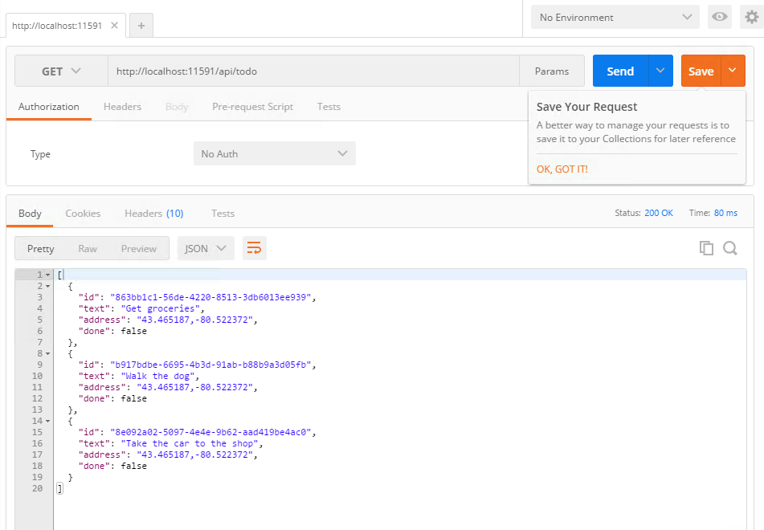

Creating the ASP.NET Backend
============================

Introduction
------------

> ASP.NET Web API is a framework that makes it easy to build HTTP services that reach a broad range of clients, including browsers and mobile devices. ASP.NET Web API is an ideal platform for building RESTful applications on the .NET Framework.

> More on [the Official ASP .NET WebApi Documentation](https://www.asp.net/web-api)


Creating an empty ASP .NET WebApi application
----------------------------------------------

First of all, let’s see how we create a WebApi solution from Visual Studio. We click New Project, then from Web we select ASP.NET Web Application, choose a name and then click Ok.


Next, choose an Empty template from ASP.NET 4.6 Templates, with WebApi folders included, with No Authentication and not Hosted in the Cloud. 


Now we have a basic structure for implementing a web service that will help us Create, Read, Update and Delete ToDo items in our mobile applications.

Cloning the GitHub repository
-----------------------------

In this repository there are 2 braches: `master`, which contains the completed application and solution and `development`, which we will use for this workshop.

Go to [the development branch of this repository](https://github.com/microsoft-dx/cordova-azure-rest/tree/development) and either clone it locally (if you are familiar with GitHub) or just download it as a ZIP file.

Then navigate to the `src/AspNetToDoApi/` folder and open `AspNetToDoApi.sln` file with Visual Studio 2015. This will open two projects, the .NET backend and the mobile application.


Examining the .NET backend
--------------------------

Looking at what was created, we can see a few classes:

- `ToDoItem` - this class represents our to do object we will pass between the mobile application and the backend and has an id, some text, geographical coordinates of the place it was created from and a true/false value that marks if the item has been done. It also has two constructors (why?) and a method for updating the properties.

A model is an object that represents data in your application. It should contain all validation needed and all business logic.  ASP.NET WebApi can automatically serialize the models to JSON or XML, all you have to do is make sure the client (mobile application in our case) knows how to interpret the data it receives.

- `ToDoRepository` – almost all non-trivial applications have to retrieve  data from a data store – SQL database, NoSQL database, a cache or any other data store. Directly accessing the data can result in duplicated code, higher potential for errors, the inability to centralize the database access and the possibility to interchange components. 

> [For more information on the repository pattern, see this article](https://msdn.microsoft.com/en-us/library/ff649690.aspx)

The best practice when working with a data store is to separate the logic of accessing and modifying the database as a separate component. This separate component, along with the model, should contain all business logic and validation.


For our web service, we keep the items in-memory. So, the place where we keep the data will be a list of items that we will query for getting all items, getting an item by id, adding, removing and updating a item. 
 
Then, wherever we want to access our stored to do items, we just have a ToDoRepository property and call the appropriate method. 

- `ToDoController` - in WebApi, a controller is an object that handles HTTP requests. Each request is mapped to a particular controller, and based on the parameters of the request, to a specific action (method) on the controller. 

Before the implementation of a controller method (action), we can specify the HTTP verb that this controller action will use: [HttpGet], [HttpPost], [HttpDelete], etc. 

> An important thing to remember when working with controllers is that the framework always creates a new instance on every request. This is the reason why in this case (remember this is a mock project) – our repository is created as static – so only a single instance of it exists, regardless of how many objects are instantiated.  

Creating the controller methods
-------------------------------

Your task is to create the appropriate controller methods required in order to Create, Read, Update and Delete to do items in the application. Remember to follow the REST standard and specify the HTTP method you want to use.

Testing the application locally
-------------------------------

Now that you created the controller methods, it is time to test the application, and we will do this in several ways:

- using the browser: start the project from Visual Studio, open a new browser tab and navigate to `http://localhost:port-number/api/todo`  - because from accessing a URL from the browser you can only execute a `GET` request in order to test the other controller methods we will need an additional tool.

- using [PostMan](https://chrome.google.com/webstore/detail/postman/fhbjgbiflinjbdggehcddcbncdddomop) - a Google Chrome extension that makes it easy to make HTTP requests.



You can also execute POST, PUT or DELETE requests with the appropriate method and parameters.

- using the ToDo mobile application - in the same Visual Studio solution there is another project called `AngularJSTodoApp` that contains the Cordova mobile application. Executing right click --> Debug --> Start new instance should trigger the build process that will start a new browser tab with the Android mobile emulator with the application. If everything works well, you should see something similar to:


The application is fully functional, you can add items, mark them as completed or delete them.
You can see that the changes are persistant - you can modify with PostMan and check in the application or the other way around.

Publishing the application to the Cloud - Azure
------------------------------------------------

Assuming you created a Microsoft Azure account, we will deploy the backend we just created to the Cloud so our backend is public and not bound to localhost. To do this, right click the project and click publish.


Choose a name, resource group and service plan for your application and then publish your application.

> Note that if you chose `application-name` as the name of your application, you will be able to access it at `application-name.azurewebsites.net`.

At this point you can test the application in the same way with the browser and with PostMan, just by changing the URL from `localhost` to `application-name.azurewebsites.net`

In order to test the mobile application, we need to make a change in the code: in `AngularJsTodoApp/www/scripts/services`, open the `azureStorage.js` file and locate:

```
	//var AZURE_API_ADDRESS = 'http://youraddress.azurewebsites.net';
	var AZURE_API_ADDRESS = 'http://localhost:11591';
```

Comment the line with `localhost`,  uncomment and add your own application url that you just created, save and run the project again.

> If you want to test a public and functional backend, you can use this URL - `http://aspnet-todo-api.azurewebsites.net/`

The applicatin should run in the same way, just that now it makes requests to a public endpoint and not to `localhost`