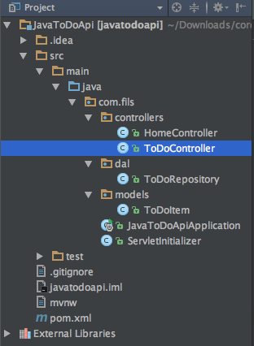
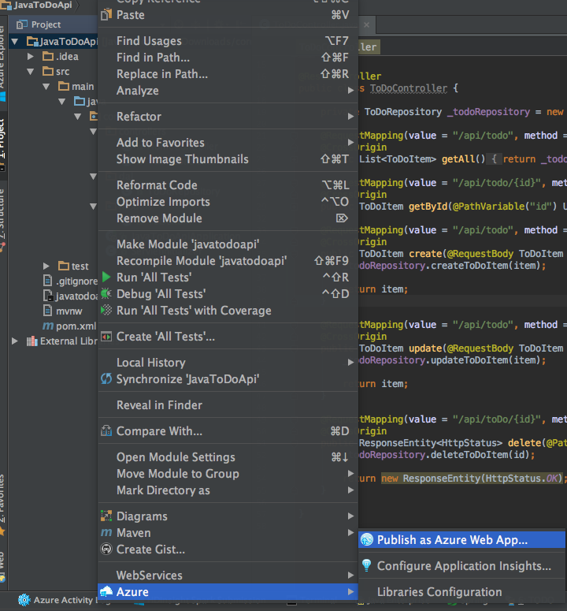
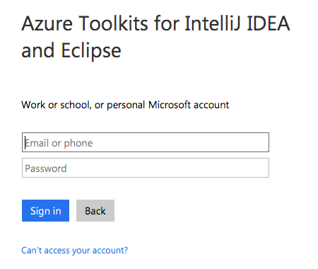
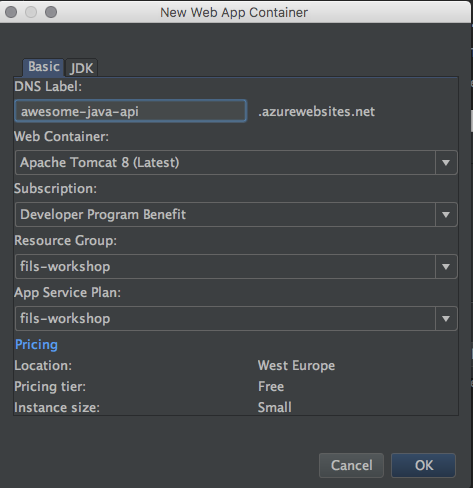
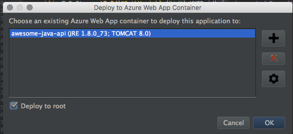
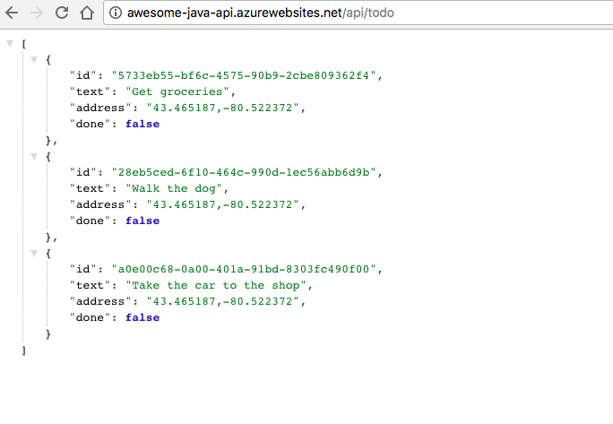

Creating the Java Spring backend
=================================

Introduction
-------------

> Spring is the most popular application development framework for enterprise Java. Millions of developers around the world use Spring Framework to create high performing, easily testable, reusable code.

> Spring framework is an open source Java platform and it was initially written by Rod Johnson and was first released under the Apache 2.0 license in June 2003.

> [For a complete list of Spring projects and examples, see this article.](https://spring.io/guides)

We will create the same backend for our mobile application, this time using Java and Spring. The concepts are very similar, and many steps involved in testing the application will be identical.


Importing the project in IntelliJ
----------------------------------

First of all, we need to get the `development` branch of our repository locally. We can use git command  `git clone -b developent https://github.com/microsoft-dx/cordova-azure-rest` or we can follow this link and [download the project as a ZIP](https://github.com/microsoft-dx/cordova-azure-rest/tree/development).

After this, open your favourite Java IDE (in our case IntelliJ Idea) and import the project: File --> New --> Project from Existing Sources, then select the location of the JavaToDoApi project you just downloaded from GitHub and import from a Maven model.


This is how it should look after importing:



Examining the Java backend
--------------------------

Looking at the project, we can see a few classes:

- `ToDoItem` - this class represents our to do object we will pass between the mobile application and the backend and has an id, some text, geographical coordinates of the place it was created from and a true/false value that marks if the item has been done. It also has two constructors (why?) and a method for updating the properties.

A model is an object that represents data in your application. It should contain all validation needed and all business logic.  Spring can automatically serialize the models to JSON or XML, all you have to do is make sure the client (mobile application in our case) knows how to interpret the data it receives.

 `ToDoRepository` – almost all non-trivial applications have to retrieve  data from a data store – SQL database, NoSQL database, a cache or any other data store. Directly accessing the data can result in duplicated code, higher potential for errors, the inability to centralize the database access and the possibility to interchange components. 

> [For more information on the repository pattern, see this article](https://msdn.microsoft.com/en-us/library/ff649690.aspx)

The best practice when working with a data store is to separate the logic of accessing and modifying the database as a separate component. This separate component, along with the model, should contain all business logic and validation.


For our web service, we keep the items in-memory. So, the place where we keep the data will be a list of items that we will query for getting all items, getting an item by id, adding, removing and updating an item. 
 
Then, wherever we want to access our stored to do items, we just have a ToDoRepository property and call the appropriate method. 

> So far, the concepts and the implementations have been identical to the ones in .NET
> The concept of controller is the same in Spring as in WebApi, but there are few implementation changes

So a controller is an object that handles HTTP requests. Each request is mapped to a particular controller, and based on the parameters of the request, to a specific action (method) on the controller.

In Spring, in order to map a controller metod to a URL you simply specify the URL as an annotation to the method and the framework takes care of the mapping.

Creating the controller methods
-------------------------------

Your task is to create the appropriate controller methods required in order to Create, Read, Update and Delete to do items in the application. Remember to follow the REST standard and specify the HTTP method you want to use.

This is how the ToDoController should look like:

```
@RestController
public class ToDoController {

    private ToDoRepository _todoRepository = new ToDoRepository();

    @RequestMapping(value = "/api/todo", method = RequestMethod.GET)
    @CrossOrigin
    public List<ToDoItem> getAll(){
        return _todoRepository.getToDoItems();
    }

    @RequestMapping(value = "/api/todo/{id}", method = RequestMethod.GET)
    @CrossOrigin
    public ToDoItem getById(@PathVariable("id") UUID id){
        return _todoRepository.getById(id);
    }

    @RequestMapping(value = "/api/todo", method = RequestMethod.POST)
    @CrossOrigin
    public ToDoItem create(@RequestBody ToDoItem item){
        _todoRepository.createToDoItem(item);

        return item;
    }

    @RequestMapping(value = "/api/todo", method = RequestMethod.PUT)
    @CrossOrigin
    public ToDoItem update(@RequestBody ToDoItem item){
        _todoRepository.updateToDoItem(item);

        return item;
    }

    @RequestMapping(value = "/api/toDo/{id}", method = RequestMethod.DELETE)
    @CrossOrigin
    public ResponseEntity<HttpStatus> delete(@PathVariable UUID id){
        _todoRepository.deleteToDoItem(id);

        return new ResponseEntity(HttpStatus.OK);
    }

}
``` 

Testing the application locally
-------------------------------

Since we accomplished exactly the same thing as before, testing the application locally is done in virtually the [same way as described for a .NET backend here](https://github.com/microsoft-dx/cordova-azure-rest/tree/master/docs/exercise01#testing-the-application-locally), with the browser, PostMan or the Cordova mobile application.


Publishing the application to the Cloud - Azure
------------------------------------------------

Assuming you created a Microsoft Azure account, we will deploy the backend we just created to the Cloud so our backend is public and not bound to `localhost`. To do this, you must first install the [Micosoft Azure ToolKit for IntelliJ](https://plugins.jetbrains.com/plugin/8053). After that, simply right click the project, scroll all the way down to Azure and select Publish as Azure Web App.



Then you need to sign in using your Microsoft Account.



> [To understand all the steps involved, please read this article](https://docs.microsoft.com/en-us/azure/app-service-web/app-service-web-intellij-create-hello-world-web-app#to-deploy-your-application-to-an-azure-web-app-container).



- Enter a DNS Label for your Web App Container; this will form the leaf DNS label of the host URL for your web application in Azure. Note that the name must be available and conform to Azure Web App naming requirements.
In the Web Container drop-down menu, select the appropriate software for your application.

- Currently, you can choose from Tomcat 8, Tomcat 7 or Jetty 9. A recent distribution of the selected software will be provided by Azure, and it will run on a recent distribution of JDK 8 created by Oracle and provided by Azure.

- In the Subscription drop-down menu, select the subscription you want to use for this deployment.
In the Resource Group drop-down menu, select the Resource Group with which you want to associate your Web App. (Azure Resource Groups allow you to group related resources together so that, for example, they can be deleted together.)

- You can select an existing Resource Group (if you have any) and skip to step g below, or use the following these steps to create a new Resource Group:

- Click New. The New Resource Group dialog box will be displayed:


- In the the Name textbox, specify a name for your new Resource Group.
- In the the Region drop-down menu, select the appropriate Azure data center location for your Resource Group.
- Click OK.

The App Service Plan drop-down menu lists the app service plans that are associated with the Resource Group that you selected. (An App Service Plan specifies information such as the location of your Web App, the pricing tier and the compute instance size. A single App Service Plan can be used for multiple Web Apps, which is why it is maintained separately from a specific Web App deployment.)

You can select an existing App Service Plan (if you have any) and skip to step h below, or use the following these steps to create a new App Service Plan:

Click New...
The New App Service Plan dialog box will be displayed:


- In the the Name textbox, specify a name for your new App Service Plan.
- In the the Location drop-down menu, select the appropriate Azure data center location for the plan.
- In the the Pricing Tier drop-down menu, select the appropriate pricing for the plan. For testing purposes you can choose Free.
- In the the Instance Size drop-down menu, select the appropriate instance size for the plan. For testing purposes you can choose Small.

Once you have completed all of the above steps, the New Web App Container dialog box should resemble the following illustration:


- Click OK to complete the creation of your new Web App container.

Wait a few seconds for the list of the Web App containers to be refreshed, and your newly-created web app container should now be selected in the list.

You are now ready to complete the initial deployment of your Web App to Azure; click OK to deploy your Java application to the selected Web App container. By default, your application will be deployed as a subdirectory of the application server.

Then check the `Deploy to Root` option and click Ok:




Then, the it should deploy it and you should be able to access the URL (`application-name.azurewebsites.net`) and test your application.



In order to test the mobile application, we need to make a change in the code: in `AngularJsTodoApp/www/scripts/services`, open the `azureStorage.js` file and locate:

```
	//var AZURE_API_ADDRESS = 'http://youraddress.azurewebsites.net';
	var AZURE_API_ADDRESS = 'http://localhost:11591';
```

Comment the line with `localhost`,  uncomment and add your own application url that you just created, save and run the project again.

> If you want to test a public and functional backend, you can use this URL - `http://java-todo.azurewebsites.net/`

The application should run in the same way, just that now it makes requests to a public endpoint and not to `localhost`